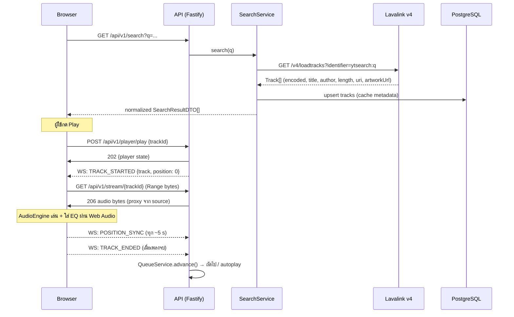

# System Architecture

> ภาพรวม component, ความรับผิดชอบ, data flow และการ scale ของ MusicPlayer

---

## 1. High-Level Architecture

```text
┌─────────────────────────────── Browser ────────────────────────────────┐
│  React SPA (Vite + TS + Tailwind)                                       │
│  ┌────────────┐  ┌──────────────┐  ┌───────────────────────────────┐    │
│  │ React UI   │  │ Zustand      │  │ AudioEngine                   │    │
│  │ (pages/    │  │ stores       │  │  <audio> ← HTTP Range stream  │    │
│  │ components)│  │ (player,     │  │   └ MediaElementSource        │    │
│  │            │  │  queue, ui,  │  │     → EQ ×10 → Gain → out    │    │
│  │            │  │  search)     │  │                               │    │
│  └────────────┘  └──────────────┘  └───────────────────────────────┘    │
│         │              │                        │                       │
│         │        TanStack Query          progress/stall/end events     │
└─────────┼──────────────┼────────────────────────┼───────────────────────┘
          │ HTTPS REST   │ Socket.IO (WSS)        │
          ▼              ▼                        ▼
┌──────────────────────── Node.js Backend (Fastify) ─────────────────────┐
│  ┌────────────────────────────── API Layer ─────────────────────────┐  │
│  │ Auth / Search / Tracks / Playlists / Likes / History / Radio     │  │
│  │ Queue / Player / Stream / Settings / EQ                          │  │
│  └──────────────────────────────┬───────────────────────────────────┘  │
│  ┌─────────────── Service Layer ─┴──────────────────────────────────┐  │
│  │ SearchService ──────► LavalinkClient (REST /v4/loadtracks)       │  │
│  │ StreamService ──────► StreamProxy (Range, SSRF-guard)            │  │
│  │ PlayerService │ QueueService │ PlaylistService                   │  │
│  │ HistoryService │ LikeService │ SettingsService                   │  │
│  │ RecommendationService (rule-based, pluggable)                    │  │
│  └───────────────┬──────────────────────────────────────────────────┘  │
│  ┌────────────── Repository Layer (Drizzle ORM) ────────────────────┐  │
│  └──────────────┬───────────────────────────────────────────────────┘  │
└─────────────────┼──────────────────────────────────────────────────────┘
                  │
     ┌────────────┼───────────────┬────────────────────┐
     ▼            ▼               ▼                    ▼
┌──────────┐ ┌─────────┐   ┌────────────┐      ┌──────────────┐
│Lavalink  │ │PostgreSQL│  │ Resolver   │      │ Redis        │
│v4 (JVM)  │ │          │  │ service    │      │ (optional,   │
│+ LavaSrc │ │ source   │  │ (yt-dlp) → │      │  phase 13)   │
│(metadata:│ │ of truth│  │ YouTube    │      │              │
│yt+spotify│ └─────────┘  │ (zero disk)│      └──────────────┘
└──────────┘              └────────────┘
```

## 2. ความรับผิดชอบของแต่ละ Component

### Browser

| Component        | ความรับผิดชอบ                                                                   |
|------------------|---------------------------------------------------------------------------------|
| React UI         | หน้าจอ, การ interact, แสดงผล state                                             |
| Zustand stores   | Client-side state: player (mirror), queue (mirror), search cache, UI state       |
| TanStack Query   | Server state: search results, playlists, likes, history (fetch/cache/invalidate) |
| AudioEngine      | **ตัวเล่นเสียงจริงเพียงที่เดียว** — โหลด stream, เล่น, รายงาน position/stall/end, ใส่ EQ |
| Socket.IO client | รับ push events, ขอ resync, ส่ง playback progress                              |

### Backend

| Service               | ความรับผิดชอบ (รายละเอียดใน backend.md)                                        |
|-----------------------|--------------------------------------------------------------------------------|
| AuthService           | สมัคร/ล็อกอิน, refresh token rotation, session                                 |
| SearchService         | รับคำค้น → เรียก Lavalink `/v4/loadtracks` → normalize → cache/upsert `tracks` |
| StreamService         | แปลง trackId → playable stream URL (resolver) + proxy เสียงพร้อม Range + SSRF guard |
| PlayerService         | **ผู้มีอำนาจสูงสุดเรื่อง playback intent** (state machine, volume, position tracking) |
| QueueService          | Queue + playback history + shuffle/repeat logic                                 |
| PlaylistService       | CRUD playlist + ลำดับเพลง                                                       |
| HistoryService        | บันทึก/สอบถาม listening history                                                 |
| RecommendationService | Rule-based candidate/scoring, ให้ทั้ง home feed และ radio/autoplay              |

### External

| Component | บทบาท                                                                              |
|-----------|-------------------------------------------------------------------------------------|
| Lavalink v4 | **ใช้แค่ track resolution/search** — ไม่ใช่ตัวส่งเสียง (เหตุผล: ADR-003); มี **LavaSrc plugin** สำหรับ Spotify metadata (`spsearch`) |
| Spotify Web API | **Metadata เท่านั้น** — ค้นหา, playlist import, **genre enrichment** (artist genres); ไม่มีเสียง (grilling 2026-09-20) |
| Resolver service | แยก container (yt-dlp based): trackId → stream URL อายุสั้นของ YouTube ([ADR-008](./adr/008-youtube-first-no-local-storage.md)) |
| PostgreSQL | Source of truth ของ users, tracks, playlists, history, settings, queue snapshot    |
| Redis      | Optional: search cache, rate-limit counters, pub/sub สำหรับ multi-instance (phase 13) |

## 3. Data Flow หลัก

### 3.1 Search → Play



### 3.2 แนวคิด "Backend-authoritative intent, Client-authoritative rendering"

- **Intent** (เล่นอะไร, pause, seek ไหน, repeat/shuffle อะไร, volume/EQ เท่าไร) — ตัดสินใจและเก็บที่ backend, broadcast ผ่าน WS
- **Rendering** (decode เสียง, ตำแหน่งเวลาจริงของเสียงที่ได้ยิน) — เกิดที่ browser เพราะ Lavalink ส่งเสียงถึง browser ไม่ได้ (ADR-003)
- ผลลัพธ์: backend เป็น single source of truth เชิง logic แต่ต้อง "เชื่อ" playback events ที่ client ส่งมา และมี watchdog (ถ้า client เงียบเกิน N วินาที ถือว่า stalled)
- แนวทางนี้เปิดทางให้ phase ถัดไปย้าย rendering ไป server-side (FFmpeg/HLS) ได้โดย interface `PlaybackRenderer` ไม่เปลี่ยน (ดู audio-pipeline.md §Alternative B)

### 3.3 Dependencies

```text
Browser ── REST/WSS ──► Backend ──► PostgreSQL (hard dependency)
                              ├──► Lavalink   (soft — ถ้าล่ม: search ใช้ cache/DB ได้, playback ไฟล์ในระบบเล่นได้ปกติ)
                              └──► Media source hosts (soft ต่อ track — ล่มเฉพาะเพลงนั้น)
```

## 4. Communication Matrix

| ช่องทาง            | จาก → ไป        | ใช้เมื่อ                                  |
|--------------------|------------------|--------------------------------------------|
| REST (HTTPS)       | Browser → Backend| ทุกคำสั่งที่ต้องการ response (search, queue ops, play/pause, CRUD) |
| WebSocket (Socket.IO) | Backend → Browser | Push state: TRACK_STARTED, QUEUE_UPDATED, EQ_CHANGED ฯลฯ |
| WebSocket          | Browser → Backend | Playback progress, stall/end events, SYNC_REQUEST |
| REST               | Backend → Lavalink| `/v4/loadtracks`, `/v4/decodetrack` (server-to-server, ไม่ผ่าน browser เด็ดขาด) |
| HTTP (Range)       | Backend → Source → Browser | Audio bytes ผ่าน StreamService proxy |

## 5. Failure Points & Degrade Strategy

| Failure                     | อาการ                              | วิธีรับมือ                                                              |
|-----------------------------|-------------------------------------|--------------------------------------------------------------------------|
| Lavalink ล่ม                | Search จาก remote source ใช้ไม่ได้ | ตอบ 503 ที่ endpoint search พร้อม source ที่ใช้ได้ (local library); playback ไม่กระทบ |
| Source host ล่ม (ต่อเพลง)   | เพลงนั้นโหลดไม่ได้                 | PlayerService รับ TRACK_STALLED → ข้ามไปเพลงถัดไป + แจ้ง QUEUE_UPDATED / toast ใน UI |
| **YouTube extraction พัง**   | **ทั้งแอปไม่มีเพลงเล่น** (single-source — ADR-008) | Resolver แยก container อัปเดตง่าย + หน้า source status + local ingest fallback (Phase 14) |
| PostgreSQL ล่ม              | ทุกอย่างที่ต้อง auth/data          | 503 ทั้งระบบ + WS แจ้ง MAINTENANCE; queue ใน memory ทิ้งได้ (แต่ต้องบอกผู้ใช้) |
| WS ขาดระหว่างเล่น           | UI ไม่ sync                        | เสียงเล่นต่อ (client ยังมี stream), reconnect + SYNC_REQUEST แบบ exponential backoff |
| Stream proxy ช้า            | Buffering บ่อย                     | Range request + prebuffer 10–30 s; ถ้ายังช้า → ลด quality/แจ้งผู้ใช้ |
| Backend ล่มทั้งตัว           | เสียงหยุด                          | ไม่มี fallback ใน MVP — SPOF ยอมรับได้ (ดู Scaling)                      |

## 6. Scaling Considerations

**MVP (single instance):**
- Backend 1 instance (Node.js), Lavalink 1 container, PostgreSQL 1 instance, ไม่มี Redis
- Queue/Player state อยู่ใน memory ของ backend + snapshot ลง DB ทุกครั้งที่เปลี่ยน

**เมื่อโตขึ้น (phase 13+):**
- Backend stateless ได้เมื่อย้าย player/queue state ไป Redis → scale แนวนอน + Socket.IO Redis adapter สำหรับ broadcast ข้าม instance
- ต้องมี sticky session หรือ room-per-user เพื่อให้ WS ไปถึง instance ที่ถือ state
- Stream proxy เป็นคนกิน bandwidth มากสุด (×2 จากการ proxy YouTube — ADR-008) — แยกเป็น service ของตัวเอง หรือใส่ per-track RAM cache ก่อนแยก API
- Lavalink scale แนวนอนได้แต่ stateless สำหรับการใช้งานของเรา (เรียกแต่ loadtracks จึงไม่มี session affinity ให้กังวล)

## 7. Assumptions

1. Deployment เดียว (single region) ใน MVP
2. **ผู้ใช้เป้าหมาย: ส่วนตัว/กลุ่มเล็ก 1–5 concurrent** (grilling 2026-09-20) — ไม่ออกแบบเพื่อ scale สาธารณะ; ดู trigger การขยายใน §6
3. **ไม่มี media storage ในระบบเลย** (zero storage ตาม [ADR-008](./adr/008-youtube-first-no-local-storage.md)) — เพลงทั้งหมดสตรีมจาก YouTube ผ่าน RAM; Spotify ให้ metadata เท่านั้น

## 8. Open Questions

1. Phase 13 ควรแยก stream service ออกจาก API service ตั้งแต่แรกไหม? (ค่าเริ่มต้น: ยังไม่แยก)
2. ค่า bandwidth ×2 (YouTube → server → client) ควรตั้งงบ/monitor อย่างไร — กับ 1–5 คนถือว่าต่ำ แต่ควรวัดตั้งแต่ Phase 13 (k6) เพื่อมี baseline

## 9. Risks

| Risk                                 | ผลกระทบ | บรรเทา                                                                     |
|--------------------------------------|-----------|------------------------------------------------------------------------------|
| ผู้ใช้ (หรือ client ที่ถูกแก้ไข) ส่ง playback events ปลอม | History/recommendation เพี้ยน | Rate-limit + sanity check (position ไม่วิ่งเร็วกว่าเวลาจริง, durationPlayed ≤ length) |
| Stream proxy กลายเป็น open relay (SSRF) | ความปลอดภัยระดับวิกฤต | Allowlist โดเมน + บล็อก private IP + ไม่รับ URL จาก client โดยตรง (ดู security.md) |
| YouTube ToS หากเปิด extraction      | กฎหมาย/บล็อก IP | แยกเป็น phase B + ตั้ง flag ปิดได้ (ADR-003)                                |
