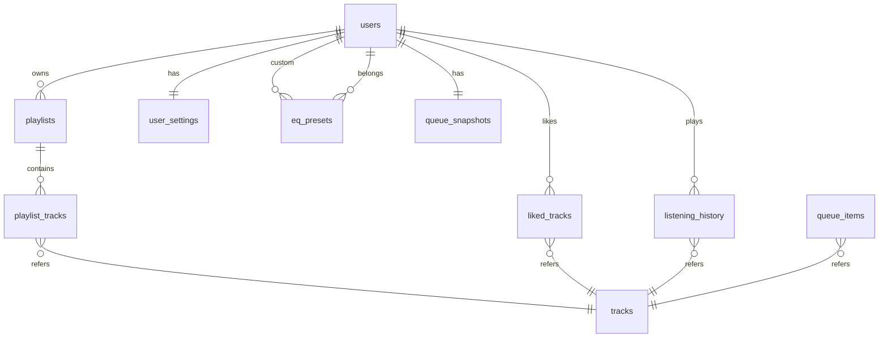

# Database Schema (PostgreSQL)

> PostgreSQL 16 + Drizzle ORM (เหตุผล ORM อยู่ใน [ADR-002](./adr/002-use-postgresql.md))
> ทุก table ใช้ UUID primary key (`gen_random_uuid()`, pgcrypto/PG16 built-in) ยกเว้นที่ระบุไว้เป็นอย่างอื่น
> ทุก table มี `created_at TIMESTAMPTZ NOT NULL DEFAULT now()`

---

## 1. ภาพรวมความสัมพันธ์

## 2. Tables

### 2.1 `users`

| Column        | Type         | Nullable | หมายเหตุ                     |
| ------------- | ------------ | -------- | ---------------------------- |
| id            | UUID         | NO       | PK                           |
| email         | VARCHAR(255) | NO       | **UNIQUE**, stored lowercase |
| password_hash | VARCHAR(255) | NO       | argon2id                     |
| display_name  | VARCHAR(100) | NO       |                              |
| updated_at    | TIMESTAMPTZ  | NO       |                              |

- Index: `UNIQUE(email)`
- Soft delete: ไม่ใช้ (MVP) — hard delete + cascade; ทำ deleted_at เมื่อมี compliance requirement

### 2.2 `tracks` (track registry / metadata cache)

| Column            | Type         | Nullable | หมายเหตุ                                                                                                                                                                                                              |
| ----------------- | ------------ | -------- | --------------------------------------------------------------------------------------------------------------------------------------------------------------------------------------------------------------------- |
| id                | UUID         | NO       | PK — **trackId ที่ทั้งระบบใช้อ้างถึง**                                                                                                                                                                                |
| source_name       | VARCHAR(50)  | NO       | `local` \| `http` \| `youtube` \| `soundcloud` \| ... (จาก Lavalink `sourceName` หรือค่าเราเอง)                                                                                                                       |
| source_identifier | VARCHAR(500) | NO       | id ใน source (เช่น video id) หรือ path/URL                                                                                                                                                                            |
| title             | VARCHAR(500) | NO       |                                                                                                                                                                                                                       |
| artist            | VARCHAR(500) | NO       | ผู้แต่งตามที่ source ให้ (`author`) — MVP เก็บ string เดียว                                                                                                                                                           |
| album             | VARCHAR(500) | YES      | ถ้ามี                                                                                                                                                                                                                 |
| genres            | TEXT[]       | NO       | default `'{}'` — แนวเพลง; เพลงจาก YouTube **ไม่มี genre tag** → เติมจาก **Spotify Web API** (artist genres, cache ผลลัพธ์) ตอน resolve ([ADR-008](./adr/008-youtube-first-no-local-storage.md) + grilling 2026-09-20) |
| duration_ms       | INTEGER      | NO       | `length` จาก Lavalink; stream ใช้ NULL→ แต่ schema NOT NULL → ใช้ 0 แทน `isStream=true`                                                                                                                               |
| is_stream         | BOOLEAN      | NO       | live stream (ไม่มี duration)                                                                                                                                                                                          |
| is_seekable       | BOOLEAN      | NO       |                                                                                                                                                                                                                       |
| stream_url        | TEXT         | YES      | สำหรับ source `http` (ค่าที่ proxy ได้); ไม่ return ให้ client เด็ดขาด                                                                                                                                                |
| file_path         | TEXT         | YES      | สำหรับ source `local` เท่านั้น — **MVP ไม่มี local ingest** (zero storage ตาม ADR-008); คอลัมน์นี้คงไว้สำหรับ Phase 14 (fallback)                                                                                     |
| content_type      | VARCHAR(100) | YES      | เช่น `audio/mpeg` — ใช้ตรวจ codec support + ตอบ Content-Type ตอน proxy                                                                                                                                                |
| artwork_url       | TEXT         | YES      |                                                                                                                                                                                                                       |
| isrc              | VARCHAR(15)  | YES      |                                                                                                                                                                                                                       |
| lavalink_encoded  | TEXT         | YES      | base64 encoded track ของ Lavalink (ใช้ re-resolve/debug)                                                                                                                                                              |
| resolved_at       | TIMESTAMPTZ  | NO       | อายุ metadata — re-resolve เมื่อเก่า/404                                                                                                                                                                              |
| updated_at        | TIMESTAMPTZ  | NO       |                                                                                                                                                                                                                       |

- **UNIQUE(source_name, source_identifier)** — กัน duplicate จากการ search ซ้ำ
- Index: `UNIQUE(source_name, source_identifier)`; `INDEX(title, artist)` แบบ `pg_trgm` สำหรับ fuzzy search ใน local library (GIN index บน trigram); `GIN(genres)` สำหรับ query "same genre" ของ recommendation
- ไม่มี FK ที่อ้างเข้ามาแบบ cascade จากฝั่ง tracks เอง

### 2.3 `playlists`

| Column      | Type         | Nullable | หมายเหตุ                                                                      |
| ----------- | ------------ | -------- | ----------------------------------------------------------------------------- |
| id          | UUID         | NO       | PK                                                                            |
| user_id     | UUID         | NO       | FK → users.id, ON DELETE CASCADE                                              |
| name        | VARCHAR(200) | NO       |                                                                               |
| description | TEXT         | YES      |                                                                               |
| cover_url   | TEXT         | YES      |                                                                               |
| is_deleted  | BOOLEAN      | NO       | default false — soft delete เพราะ playlist ถูกอ้างโดย queue/history เป็นบริบท |
| deleted_at  | TIMESTAMPTZ  | YES      |                                                                               |
| updated_at  | TIMESTAMPTZ  | NO       |                                                                               |

- Index: `INDEX(user_id)`, `UNIQUE(user_id, name) WHERE is_deleted = false` (ชื่อซ้ำไม่ได้ต่อ user)

### 2.4 `playlist_tracks`

| Column      | Type        | Nullable | หมายเหตุ                                                                                                 |
| ----------- | ----------- | -------- | -------------------------------------------------------------------------------------------------------- |
| id          | UUID        | NO       | PK                                                                                                       |
| playlist_id | UUID        | NO       | FK → playlists.id, ON DELETE CASCADE                                                                     |
| track_id    | UUID        | NO       | FK → tracks.id, ON DELETE RESTRICT (เพลงถูกเล่นมาแล้ว — เก็บ history ไว้; ลบ track ต้องผ่าน cleanup job) |
| position    | INTEGER     | NO       | ลำดับภายใน playlist (เริ่ม 0)                                                                            |
| added_at    | TIMESTAMPTZ | NO       | default now()                                                                                            |

- Index: `UNIQUE(playlist_id, position)` (บังคับลำดับไม่ซ้ำ — update ทั้งชุดใน transaction เมื่อ reorder)

### 2.5 `liked_tracks`

| Column   | Type        | Nullable | หมายเหตุ                                        |
| -------- | ----------- | -------- | ----------------------------------------------- |
| user_id  | UUID        | NO       | FK → users.id, PK ส่วนหนึ่ง                     |
| track_id | UUID        | NO       | FK → tracks.id, ON DELETE CASCADE, PK ส่วนหนึ่ง |
| liked_at | TIMESTAMPTZ | NO       | default now()                                   |

- PK: `(user_id, track_id)`
- Index: `INDEX(user_id, liked_at DESC)` — หน้า Liked Songs เรียงใหม่→เก่า

### 2.6 `listening_history`

| Column       | Type        | Nullable | หมายเหตุ                                     |
| ------------ | ----------- | -------- | -------------------------------------------- |
| id           | UUID        | NO       | PK (big data — ไม่ใช้ composite PK)          |
| user_id      | UUID        | NO       | FK → users.id, ON DELETE CASCADE             |
| track_id     | UUID        | NO       | FK → tracks.id, ON DELETE RESTRICT           |
| played_at    | TIMESTAMPTZ | NO       | default now()                                |
| ms_played    | INTEGER     | NO       | เวลาที่เล่นจริง (≤ duration)                 |
| completed    | BOOLEAN     | NO       | เล่นจบเพลง                                   |
| skipped      | BOOLEAN     | NO       | ผู้ใช้ skip ก่อนจบ                           |
| context_type | VARCHAR(20) | YES      | `queue` \| `radio` \| `playlist` \| `search` |
| context_id   | UUID        | YES      | เช่น playlist id                             |

- Index: `INDEX(user_id, played_at DESC)` — timeline query หลัก; `INDEX(user_id, track_id)` — สำหรับ recommendation (frequently played)
- ปริมาณโตเร็วที่สุดในระบบ → เป็นตารางเดียวที่วางแผน partition ตามเวลาได้ (ออกนอก MVP)

### 2.7 `user_settings`

| Column              | Type        | Nullable | หมายเหตุ                                                      |
| ------------------- | ----------- | -------- | ------------------------------------------------------------- |
| user_id             | UUID        | NO       | PK, FK → users.id, ON DELETE CASCADE                          |
| volume              | SMALLINT    | NO       | default 80 (0–100)                                            |
| muted               | BOOLEAN     | NO       | default false                                                 |
| autoplay            | BOOLEAN     | NO       | default true                                                  |
| repeat_mode         | VARCHAR(5)  | NO       | `off` \| `one` \| `all`                                       |
| shuffle             | BOOLEAN     | NO       | default false                                                 |
| active_eq_preset_id | UUID        | YES      | FK → eq_presets.id (SET NULL เมื่อ preset ถูกลบ; NULL = flat) |
| locale              | VARCHAR(5)  | NO       | default `'th'` (`th` \| `en`) — ภาษา UI (รองรับสองภาษา)       |
| updated_at          | TIMESTAMPTZ | NO       |                                                               |

### 2.8 `eq_presets`

| Column     | Type         | Nullable | หมายเหตุ                                                                               |
| ---------- | ------------ | -------- | -------------------------------------------------------------------------------------- |
| id         | UUID         | NO       | PK                                                                                     |
| user_id    | UUID         | YES      | NULL = **system preset**; FK → users.id, ON DELETE CASCADE                             |
| name       | VARCHAR(100) | NO       |                                                                                        |
| bands      | JSONB        | NO       | `[{"freq":31.25,"gain":0,"q":1.0}, ...]` × 10                                          |
| is_system  | BOOLEAN      | NO       | default false (generated column จาก user_id IS NULL ได้ แต่เก็บตรง ๆ เพื่อ query ง่าย) |
| updated_at | TIMESTAMPTZ  | NO       |                                                                                        |

- Index: `UNIQUE(user_id, name)` — custom preset ต่อ user ชื่อซ้ำไม่ได้ (system presets ใช้ seed)
- ค่า bands validate ที่ application layer: gain ∈ [-12, +12], 10 bands, ความถี่ fix ตาม equalizer.md

### 2.9 `queue_snapshots` + `queue_items` (restore หลัง restart)

`queue_snapshots`:

| Column        | Type        | Nullable | หมายเหตุ                             |
| ------------- | ----------- | -------- | ------------------------------------ |
| user_id       | UUID        | NO       | PK, FK → users.id, ON DELETE CASCADE |
| current_track | UUID        | YES      | FK → tracks.id                       |
| position_ms   | INTEGER     | NO       | ตำแหน่งล่าสุด (จาก POSITION_SYNC)    |
| shuffle_on    | BOOLEAN     | NO       |                                      |
| repeat_mode   | VARCHAR(5)  | NO       |                                      |
| updated_at    | TIMESTAMPTZ | NO       |                                      |

`queue_items` (ทั้ง upcoming และ history — แยกด้วย `kind`):

| Column            | Type       | Nullable | หมายเหตุ                                                                          |
| ----------------- | ---------- | -------- | --------------------------------------------------------------------------------- |
| id                | UUID       | NO       | PK                                                                                |
| user_id           | UUID       | NO       | FK → users.id, ON DELETE CASCADE                                                  |
| kind              | VARCHAR(4) | NO       | `upc` (upcoming) \| `hist` (history)                                              |
| track_id          | UUID       | NO       | FK → tracks.id, ON DELETE CASCADE                                                 |
| position          | INTEGER    | NO       | ลำดับ (upcoming: ต้น→ปลาย; history: ใหม่→เก่า ใช้ position ติดลบหรือแยก ordering) |
| original_position | INTEGER    | NO       | ลำดับก่อน shuffle (สำหรับ unshuffle)                                              |

- Index: `UNIQUE(user_id, kind, position)`

## 3. การตัดสินใจทั่วไป

| หัวข้อ         | ตัดสินใจ                                                                                                                 |
| -------------- | ------------------------------------------------------------------------------------------------------------------------ |
| UUID vs BIGINT | UUID — trackId ปรากฏใน URL/queue ของผู้ใช้, ไม่เดาได้, สร้างฝั่ง client ได้ในอนาคต                                       |
| Timestamps     | `TIMESTAMPTZ` ทุกที่                                                                                                     |
| Migration      | Drizzle Kit (`drizzle-kit generate/migrate`) — schema-as-code, ต้อง review SQL ที่ generate                              |
| Search         | Local search ใช้ `pg_trgm` (GIN trigram บน title+artist); เก็บไว้เปลี่ยนเป็น tsvector/full-text หรือ external search ได้ |
| Soft delete    | เฉพาะ playlists; users/tracks ยังไม่ต้อง (แต่ design ไม่ปิดทาง)                                                          |
| money/บัตร     | ไม่มี (ไม่ใช่ use case)                                                                                                  |

## 4. Queries สำคัญและ Index รองรับ

| Query                                        | Index ที่รองรับ                             |
| -------------------------------------------- | ------------------------------------------- |
| หน้า Liked เรียงใหม่→เก่า                    | `(user_id, liked_at DESC)`                  |
| Timeline history + cursor pagination         | `(user_id, played_at DESC)`                 |
| Frequently played (recommendation)           | `(user_id, track_id)` + aggregate           |
| Same-genre candidates (recommendation/radio) | GIN `(genres)` + filter genre ∈ seed genres |
| Search local library (fuzzy)                 | GIN trigram `(title, artist)`               |
| Dedupe track ตอน search/Lavalink upsert      | `UNIQUE(source_name, source_identifier)`    |
| Playlist tracks ตามลำดับ                     | `UNIQUE(playlist_id, position)`             |

## 5. Assumptions

1. Track ที่ถูกลบ (cleanup job ภายหลัง) จะไม่ FK RESTRICT ถ้ายังมี history → ใช้ cleanup job ที่ลบ history ย้อนอายุออกก่อน
2. `artist`/`album` เก็บเป็น string ใน tracks (ไม่ normalize เป็นตารางแยกใน MVP) — เพราะผู้ใช้ยืนยันแล้วว่า recommendation เน้น **แนวเพลง (genres)** ไม่ใช่ศิลปิน/อัลบั้มเป็นหลัก → ความจำเป็นของ normalized artists/albums ลดลง และ genre เป็นสิ่งที่ normalize ยากอยู่แล้ว (tag จากหลาย source ไม่ตรงมาตรฐาน) — หากอนาคตต้องการความแม่นของศิลปิน ให้ backfill ตาราง `artists` ทีหลัง
3. **Genre taxonomy:** ใช้ค่า genre จาก ID3/Vorbis tag ของไฟล์ตรง ๆ (ไม่ force vocabulary เดียวใน MVP) — tag พิมพ์ต่างกัน (เช่น "Hip-Hop"/"Hip Hop") ถือเป็นคนละ genre → กติกา matching ทำที่ application layer ด้วย normalization (lowercase, ตัดขีด/ช่องว่าง) + mapping table เล็ก ๆ ได้ภายหลัง; **สถานะ: แก้แล้วเดิม (เดิมเป็น Open Question #1)**

## 6. Open Questions

1. ~~ควร normalize `artists`/`albums` เป็นตารางเองตั้งแต่ต้น?~~ — **ตัดสินใจแล้ว (2026-09-20):** ไม่ normalize ใน MVP, ใช้ `genres` เป็นสัญญาณ recommendation หลัก (ดู Assumptions #2) — ยังคง backfill ได้ภายหลัง
2. ~~Partition `listening_history` รายเดือน?~~ — **ปิดตาย (grilling 2026-09-20):** ไม่ทำ — ผู้ใช้เป้าหมาย 1–5 คน ข้อมูลไม่น่าจะโตถึงขั้นต้อง partition
3. ~~ใช้ read replica เมื่อไหร่?~~ — **ปิดตาย (grilling 2026-09-20):** ไม่มีใน MVP และไม่มี trigger เพราะ scale ส่วนตัว
4. ~~Controlled vocabulary ของ genre?~~ — **ตัดสินใจแล้ว (grilling 2026-09-20): ทางเลือก C** — เก็บ raw tags จาก Spotify (normalize เบา ๆ: lowercase/trim) + matching แบบ intersection ตรง ๆ ใน MVP; เปิดทางเพิ่ม mapping layer (รวม genre กลุ่มใหญ่) ภายหลังถ้าพบว่า matching แม่นไม่พอ — raw tags ที่เก็บไว้ทำให้ไม่ต้อง re-fetch
