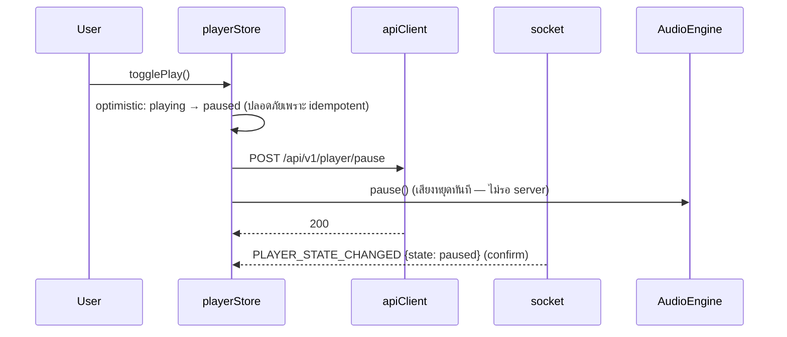

# Frontend Architecture

> React SPA (Vite + TypeScript + Tailwind CSS)
> State management: **Zustand** (client state) + **TanStack Query** (server state) — เหตุผลใน [ADR-005](./adr/005-state-management.md)

---

## 1. โครงสร้างโฟลเดอร์

```text
apps/web/src/
├── pages/                  # 1 file ต่อ route (จัด composition เท่านั้น)
│   ├── HomePage.tsx            # recommendations, recently played
│   ├── SearchPage.tsx
│   ├── LibraryPage.tsx         # tabs: Playlists / Liked / History
│   ├── PlaylistPage.tsx        # /playlist/:id
│   └── SettingsPage.tsx        # EQ, account, playback preferences
├── components/             # UI components ที่ไม่ผูก feature (Button, Modal, Slider,
│   │                       #   TrackRow, Artwork, VirtualList, EmptyState)
│   ├── player/                 # PlayerBar, ProgressBar, VolumeControl, NowPlayingView
│   ├── queue/                  # QueuePanel, QueueItem, UpNextCard
│   └── eq/                     # EqualizerPanel, EQBandSlider, PresetSelector
├── features/               # Feature-level composition (รวม components + hooks)
│   ├── search/
│   ├── playlists/
│   ├── likes/
│   ├── history/
│   └── radio/
├── hooks/                  # generic hooks (useDebounce, useMediaQuery, useKeyPress)
├── audio/                  # ⚠️ core ของแอป
│   ├── AudioEngine.ts          # ครอบ <audio> + Web Audio graph — public API: load/play/pause/seek/setVolume/applyEQ
│   ├── eqGraph.ts              # สร้าง/ปรับ BiquadFilter chain (detailed ใน equalizer.md)
│   └── events.ts               # playback event bus (stall, ended, progress, error)
├── services/               # network layer (ไม่มี state)
│   ├── apiClient.ts            # fetch wrapper + auth + error normalize
│   ├── socket.ts               # Socket.IO client singleton + typed events
│   └── endpoints/              # search.ts, player.ts, queue.ts, playlists.ts, ...
├── stores/                 # Zustand stores (ดู §3)
├── types/                  # shared types (import จาก packages/shared ถ้าทำ monorepo)
├── i18n/                   # 🌐 สองภาษาไทย/อังกฤษ (react-i18next)
│   ├── index.ts                # i18n init + lazy-load locale
│   └── locales/{th,en}.json    # ทุก string ใน UI ห้าม hardcode ใน component
└── utils/                  # formatDuration, clamp, shuffleArray, etc.
```

**กฎการจัดวาง:** `pages` ประกอบจาก `features`, `features` ประกอบจาก `components` + hooks; `audio/`, `services/`, `stores/` ไม่ import จาก React components ย้อนกลับ

## 2. AudioEngine — หัวใจของ frontend

ความรับผิดชอบ (รายละเอียดพฤติกรรมใน player.md):

- ถือ `<audio>` element **หนึ่งตัวตลอดอายุแอป** (MediaElementSource ผูก element แบบครั้งเดียว — สร้างใหม่ไม่ได้)
- สร้าง Web Audio graph ครั้งเดียวตอน boot: `MediaElementSource → EQ ×10 → Gain → destination`
- เป็นคนเดียวที่แตะ `audio.currentTime`, `audio.play()/pause()`
- ปล่อย events ผ่าน bus: `PROGRESS` (ทุก 250 ms), `STALLED`, `RECOVERED`, `ENDED`, `ERROR`
- ไม่รู้จัก queue/recommendation — ตัดสินใจเชิงนโยบายทั้งหมดอยู่ที่ store + backend

## 3. State Management

### 3.1 เลือก: Zustand (client state) + TanStack Query (server state)

- **Zustand:** player mirror, queue mirror, UI state — เขียนง่าย, ไม่มี Provider wrapper, performance ดีกับ update ถี่ (progress bar)
- **TanStack Query:** ทุกอย่างที่เป็น "ข้อมูลจาก server" (search, playlists, likes, history, settings) — ได้ cache/invalidate/retry มาฟรี
- ไม่ใช้ Redux Toolkit (boilerplate เกินจำเป็น), ไม่ใช้ Context (re-render ยากควบคุมกับ playback updates ถี่ ๆ) — เทียบเต็มใน ADR-005

### 3.2 Player Store (Zustand)

| ชื่อ state        | ที่มา                          | หมายเหตุ                                  |
|-------------------|---------------------------------|--------------------------------------------|
| `playbackState`   | WS `PLAYER_STATE_CHANGED`       | idle/loading/playing/paused/buffering/ended|
| `currentTrack`    | WS `TRACK_STARTED` / REST       | TrackDTO + trackId                         |
| `positionMs`      | AudioEngine PROGRESS (local) + WS POSITION_SYNC (แก้ drift) | local อัปเดตถี่, server sync ทุก 5 s |
| `volume`, `muted` | user action → REST + WS         |                                           |
| `repeatMode`, `shuffle` | REST + WS QUEUE_UPDATED   | mirror ของ backend state                   |

หลักการ: **store เป็น mirror ของ backend** ยกเว้น `positionMs` ที่ client เป็นเวลาจริง (เสียงอยู่ที่ client) — ทุก WS event เป็น "คำสั่งให้ mirror ตาม" ไม่ใช่แหล่งความจริง

### 3.3 Queue Store (Zustand)

- `items: QueueItem[]` (เพลงที่ยังไม่เล่น), `history: QueueItem[]` (เพลงที่เล่นแล้ว เรียงใหม่→เก่า)
- อัปเดตทั้งหมดมาจาก WS `QUEUE_UPDATED` (payload ทั้ง queue แบบ replace — ง่ายและปลอด drift) + optimistic update ตอนผู้ใช้กด (rollback ถ้า server ตอบ error)

### 3.4 User Store

- ข้อมูลโปรไฟล์, สถานะ auth (`loggedIn`, กำลัง refresh token)
- เป็น mirror ของ `GET /api/v1/me`

### 3.5 Search State (TanStack Query)

- `useSearch(query)` — debounce 300 ms, cache ตาม query key, staleTime 60 s
- ไม่เก็ใน Zustand เพราะเป็น server state ล้วน

### 3.6 UI State (Zustand)

- `isQueuePanelOpen`, `isNowPlayingFullscreen`, `theme` — ไม่ sync backend (ยกเว้น theme ถ้าต้องการ)

## 4. Data Flow ตัวอย่าง: ผู้ใช้กด Pause



> กฎ: คำสั่งที่ idempotent และกระทบเสียง (play/pause/seek/volume) ทำ optimistic ที่ client + ส่งให้ backend; คำสั่งเชิงโครงสร้าง (queue ops, like) optimistic + rollback ถ้า fail

## 5. Routing

- React Router: `/` (home), `/search`, `/library`, `/library/:tab`, `/playlist/:id`, `/settings`
- PlayerBar + QueuePanel เป็น layout-level (ไม่ unmount ตอนเปลี่ยนหน้า — เสียงต้องเล่นต่อ)

## 6. Performance Considerations

- Virtualized list สำหรับ queue/history ที่ยาว (react-window หรือเทียบเท่า)
- Progress bar อัปเดตผ่าน requestAnimationFrame + ไม่ trigger re-render ทั้ง page (selector แบบ atom ของ Zustand)
- Artwork ผ่าน `loading="lazy"` + ขนาดที่เหมาะ (proxy ผ่าน backend image endpoint ถ้า source บังคับ CORS)

## 6.1 Internationalization (i18n — ตัดสินใจจากผู้ใช้ 2026-09-20: รองรับไทย + อังกฤษ)

- Library: **react-i18next** (มาตรฐาน, lazy-load namespace ได้)
- Locale กำหนดจาก: `user_settings.locale` (backend) → fallback browser locale → `'th'`
- กฎ: ทุก string ผู้ใช้เห็นต้องผ่าน `t()` — รวม track metadata ที่เป็น UI label (ไม่แปลชื่อเพลง/ศิลปิน); วันที่/ตัวเลขผ่าน `Intl.DateTimeFormat`/`Intl.NumberFormat` ตาม locale
- สลับภาษาในหน้า Settings → PATCH `/settings { locale }` → ทุกอุปกรณ์เปลี่ยนตาม (EQ_CHANGED-style sync ไม่จำเป็น — ใช้ TanStack Query invalidate)

## 7. Assumptions

1. ไม่ทำ SSR ใน MVP (SPA เพียว ๆ) — SEO ไม่ใช่ requirement
2. Browser ปลายทางรองรับ Web Audio API และ MediaElementSource (ทุก browser ปัจจุบัน)

## 8. Open Questions

1. ~~Media Session API (media keys/lockscreen) ใส่ phase ไหน?~~ — **ใส่ MVP Phase 9 (grilling 2026-09-20):** ผูก `navigator.mediaSession` action handlers เข้ากับ player store + ตั้ง metadata/artwork ตอน TRACK_STARTED (~20–30 บรรทัด, wire เข้า commands ที่มีอยู่แล้ว)
2. ~~Dark mode?~~ — **Dark เท่านั้นใน MVP (grilling 2026-09-20)** — light mode เพิ่มภายหลังผ่าน theme tokens ที่ Tailwind กำหนดไว้
3. ~~PWA/Offline?~~ — **ไม่ทำใน MVP (grilling 2026-09-20):** ระบบ stream จาก YouTube เสมอ ไม่มีไฟล์ให้ cache offline (สอดคล้อง ADR-008); manifest เพิ่มภายหลังได้ในชั่วโมงเดียว

## 9. Risks

| Risk                                    | บรรเทา                                            |
|-----------------------------------------|----------------------------------------------------|
| MediaElementSource ผูก element ครั้งเดียว — refactor พลาดทำให้เสียงเงียบ | มี unit test สำหรับ AudioEngine graph + เขียนกฎไว้ในโค้ดเป็น comment บังคับ |
| WS events มาถี่เกินจน UI ค้าง            | Throttle POSITION_SYNC ที่ client, selector แบบ fine-grained |
| Optimistic updates ขัดแย้งกับ WS push เก่า | ใช้ version/seq number ใน payload (ดู websocket.md) |
