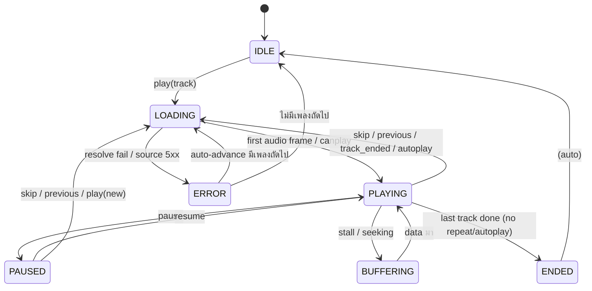

# Player State Machine

> นิยาม state, transitions, edge cases และการกู้คืนข้อผิดพลาดของ player
> ใช้ร่วมกัน 2 ฝั่ง: **Backend (authoritative intent)** และ **Frontend (AudioEngine rendering)** — ชื่อ state ต้องตรงกันเป๊ะ (แชร์ enum ผ่าน `packages/shared`)

---

## 1. States

```text
IDLE       ไม่มีเพลง / queue จบ
LOADING    กำลัง resolve + โหลด stream (ระหว่าง play command → เสียงออก)
PLAYING    เสียงกำลังเล่น
PAUSED     หยุดชั่วคราว (มี track + position)
BUFFERING  เสียงเคยเล่นแล้วแต่ data ไม่ทัน (stall) — หรือระหว่าง seek โหลดใหม่
ENDED      เพลงสุดท้ายจบ (repeat off, autoplay off) → auto ไป IDLE
ERROR      track ปัจจุบันเล่นไม่ได้ → auto-advance หรือ IDLE
```

## 2. State Diagram



## 3. Commands → Behavior

| Command  | Pre-state ที่ยอมรับ        | พฤติกรรม                                                                                |
| -------- | -------------------------- | --------------------------------------------------------------------------------------- |
| play     | any                        | ยกเลิกการโหลดปัจจุบัน → LOADING(track ใหม่); ถ้า state=PLAYING เพลงเดิม → restart ที่ 0 |
| pause    | PLAYING, BUFFERING         | → PAUSED; ถ้า LOADING → จำ intent `pauseWhenReady` (เมื่อโหลดเสร็จเข้า PAUSED ทันที)    |
| resume   | PAUSED                     | → PLAYING (ตำแหน่งเดิม)                                                                 |
| seek     | PLAYING, PAUSED, BUFFERING | clamp [0, duration-1]; → BUFFERING ชั่วครู่แล้วกลับ state เดิม; ห้ามบน isStream         |
| skip     | LOADING..ENDED             | ขอเพลงถัดไปจาก QueueService → LOADING (repeat one: skip ข้าม one ไปถัดไป)               |
| previous | มี history                 | ถ้า position > 3 s → restart เพลงปัจจุบัน; ไม่งั้น → pop history → LOADING              |
| volume   | any                        | ไม่แตะ state; GainNode + settings                                                       |
| stop     | any (internal)             | → IDLE, ล้า track ปัจจุบัน (ใช้เมื่อ clear queue all)                                   |

## 4. การแบ่งหน้าที่ Backend vs Frontend ในแต่ละ Transition

ตัวอย่าง `play(track)`:

```text
Client                          Backend
──────                          ───────
POST /player/play ────────────► validate + set state LOADING
                                broadcast PLAYER_STATE_CHANGED(LOADING)
◄──────────────────────────── 200 PlayerStateDTO
โหลด /stream/:id + เล่น
(audioprocess เริ่มได้ยิน) ──── WS ไม่จำเป็น (state PLAYING นับจากคำสั่ง play แล้ว
                                — backend ไม่รอเสียงจริงเพื่อไม่เพิ่ม latency)
```

- Backend ถือ `PLAYING` ทันทีที่สั่ง (optimistic ฝั่ง server) — ความจริงของ "เสียงออกจริงไหม" อยู่ที่ client event (`TRACK_STALLED`) ซึ่งใช้แก้ state เป็น BUFFERING/ERROR ย้อนกลับได้
- พฤติกรรมนี้ทำให้ state ฝั่งสองฝั่งอาจต่างกันชั่วครู่ (≤ 1 s) — ยอมรับได้; `SYNC_REQUEST` คือกลไกตรึงกลับ

## 5. Edge Cases

| #   | Edge case                                | พฤติกรรมที่กำหนด                                                                                                                                                                           |
| --- | ---------------------------------------- | ------------------------------------------------------------------------------------------------------------------------------------------------------------------------------------------ |
| 1   | กด Play เพลงใหมกระหว่าง LOADING          | ยกเลิก load เดิม (abort fetch + reset element) → เริ่ม LOADING เพลงใหม่ — ห้ามเสียงซ้อน                                                                                                    |
| 2   | Skip ระหว่าง LOADING                     | เหมือนกัน: abort ปัจจุบัน → LOADING เพลงถัดไป                                                                                                                                              |
| 3   | Pause ระหว่าง LOADING                    | `pauseWhenReady` — โหลดเสร็จแล้วเข้า PAUSED ทันที (ไม่เล่นแม้แต่วินาทีเดียว)                                                                                                               |
| 4   | Track error (source 404/5xx, codec)      | LOADING → ERROR → broadcast TRACK_EXCEPTION → auto-advance เพลงถัดไป (นับต่อเนื่อง ≤ 3 ครั้ง แล้ว → IDLE + toast)                                                                          |
| 5   | Lavalink disconnect                      | **ไม่กระทบ playback** (กระทบแค่ search ตอนนั้น); backend log + health check                                                                                                                |
| 6   | WS disconnect ระหว่างเล่น                | เสียงเล่นต่อ; คำสั่งใช้ REST; reconnect แล้ว SYNC_REQUEST                                                                                                                                  |
| 7   | Browser refresh / ปิดเปิด tab            | เสียงหยุด (DOM ถูกทำลาย); กลับมา → GET /player → แสดงปุ่ม "เล่นต่อ" (autoplay policy ต้องการ gesture) — position จาก snapshot                                                              |
| 8   | AudioContext suspended (autoplay policy) | AudioEngine เรียก `ctx.resume()` ใน user gesture แรกเสมอ; ถ้ายัง suspended ระหว่างที่สั่ง play แบบ programmatic (autoplay) → state ค้าง PLAYING แต่เงียบ → แสดง banner "แตะเพื่อเปิดเสียง" |
| 9   | Seek บน live stream / unseekable         | ปฏิเสธ (400) + UI disable                                                                                                                                                                  |
| 10  | Multi-tab เล่นพร้อมกัน                   | tab ที่สองสั่ง play → tab แรกได้ PLAYER_STATE_CHANGED → หยุดเสียงตัวเอง (last-writer-wins)                                                                                                 |
| 11  | Track ended แต่ autoplay โหลดไม่ทัน      | เข้า LOADING พร้อม skeleton "กำลังเลือกเพลงถัดไป" — แสดง ≤ 5 s; ถ้าเกิน → QUEUE_ENDED (ถ้าไม่มีเพลงแล้ว)                                                                                   |
| 12  | Position drift หลัง reconnect            | client เทียบ server position; ถ้าต่าง > 500 ms และ server ใหม่กว่า → seek ตาม server                                                                                                       |
| 13  | Backend restart กลางเพลง                 | client เสียงเล่นต่อ; WS reconnect; backend restore snapshot จาก DB; ถ้า state เพี้ยน → SYNC_REQUEST ตรึง                                                                                   |

## 6. Error Recovery Checklist (frontend AudioEngine)

```text
โหลดเพลงใหม่/เปลี่ยน src
  ├─ fetch stream fail (network)      → retry 3 ครั้ง (1s/2s/4s) ที่ position เดิม → TRACK_STALLED → ให้ backend ตัดสิน
  ├─ audio element 'error' (decode)   → ไม่ retry → TRACK_EXCEPTION(CODEC_UNSUPPORTED)
  ├─ 'stalled' event                  → รอ + ถ้าเกิน 10 s ไม่ progress → retry ที่ position ล่าสุด
  └─ สำเร็จ                           → เล่น; ถ้า pauseWhenReady → หยุดทันที
```

## 7. Persistence & Restore

- Backend snapshot: `queue_snapshots` (current track, position ล่าสุดจาก POSITION_SYNC ทุก 5 s + ทุก event สำคัญ) — ทน restart ได้ระดับ "เพลงเดิม ตำแหน่งใกล้เคียง (± 5 s)"
- Restore ไม่ auto-play (autoplay policy บังคับ gesture) — state คืนเป็น PAUSED พร้อม position เดิม

## 8. Implementation Constraints (สำหรับ frontend — จำไว้ตอนเขียนโค้ด)

1. สร้าง `<audio>` element + MediaElementSource **ครั้งเดียวต่อ page load** (Web Audio ผูก element แบบถาวร)
2. ต่อ source เข้า AudioContext ต้องเกิดหลัง user gesture แรก (มิฉะนั้น context suspended และ output เงียบ)
3. `audio.currentTime = x` แล้ว event `seeked` ถึงยืนยันเสร็จ — อย่า update UI progress จากค่าที่ set จนกว่า `seeked` จะมา (ใช้ BUFFERING เป็นตัวบอกช่วงนี้)

## 9. Assumptions

1. ระบบไม่พยายาม "เล่นต่อข้ามอุปกรณ์แบบ sync ระดับมิลลิวินาที" — handoff ระหว่างอุปกรณ์ = เริ่มที่ position ล่าสุดที่ snapshot ไว้
2. ผู้ใช้รับผิดชอบอุปกรณ์ output เดียวต่อ browser (ไม่มี audio output device picker ใน MVP)

## 10. Open Questions

1. ~~BUFFERING แสดงใน UI ยังไง?~~ — **ตัดสินใจแล้ว (grilling 2026-09-20):** เก็บเป็น state แยกในโค้ด แต่ UI แสดงรวมเป็น "กำลังเล่น + spinner ที่ progress bar" (progress bar หยุดวิ่งช่วง buffering)
2. ~~repeat=one + previous → ?~~ — **ตัดสินใจแล้ว (grilling 2026-09-20): restart เพลงปัจจุบันเสมอ** — ตรง intuition
